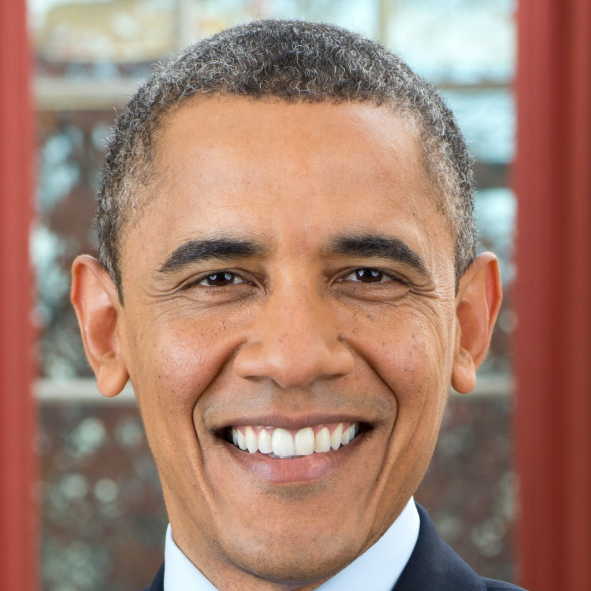
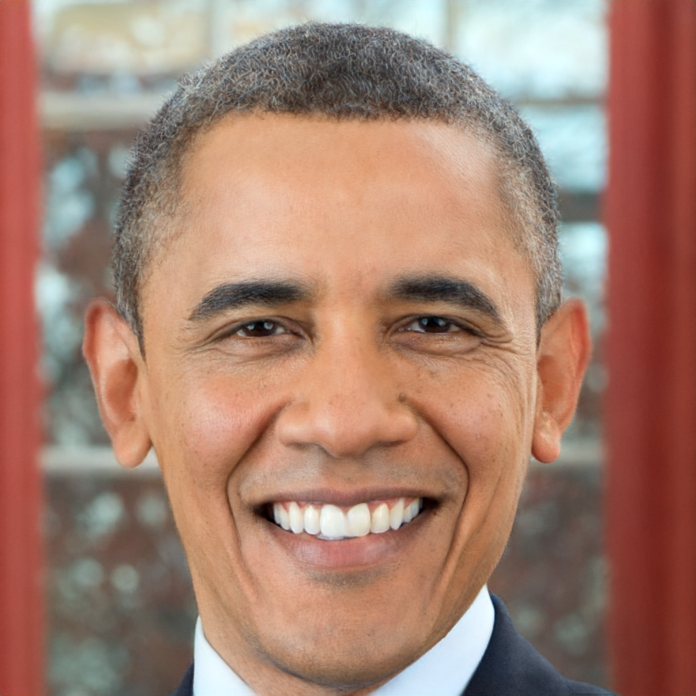
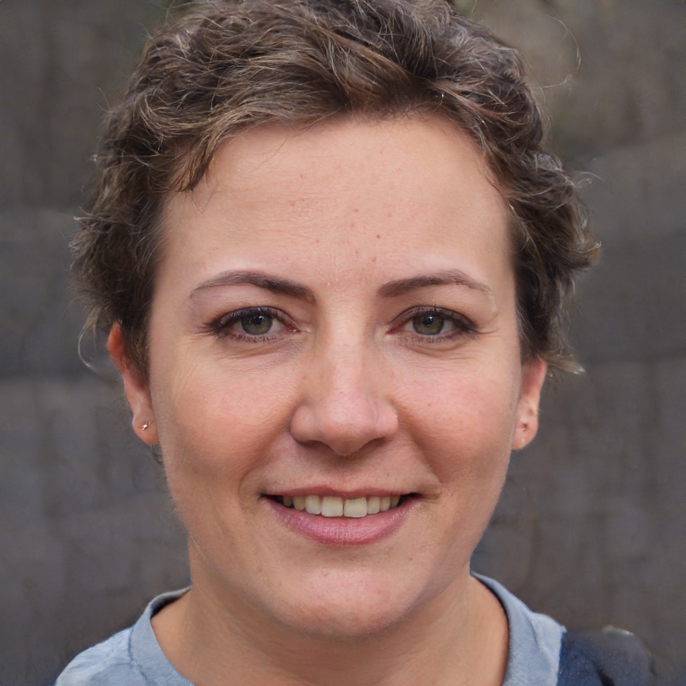

# OverparamStyleGAN

This is an unofficial implementation of Overparameterization Improves StyleGAN Inversion based
on [StyleGAN2-pytorch](https://github.com/rosinality/stylegan2-pytorch).

**Note that** only Overparam. Style Modulation is implemented here, and some implementation details are different from
the paper.

## Image Inversion

```shell
python overparams_inversion.py
```

| real                                        | inversion                                |
|---------------------------------------------|------------------------------------------|
|   |  |

## Sampling
```shell
python overparams_sampling.py
```


